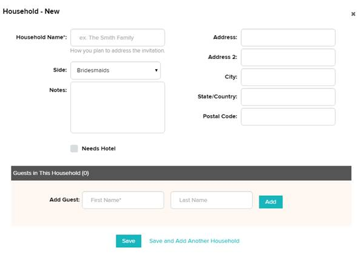

#WordPressWeddingRVSP
 
This is a Wordpress website used for a Wedding.
 
;
Functionality should be:
  
1) Allow to input Guest data 
 
2) Add Guests to different Events (Ceremony, Reception, Engagement Party, Rehearsal Dinner, Bridal Shower) on a case-by-case basis 
 
3) Export Guest lists for each Event to Excel 
 
4) Allow External Users (aka Guests) to RSVP for the Event on the website 
 
5) Have one Welcome/Information page where I can add Event Information and some kind words to our Guests
